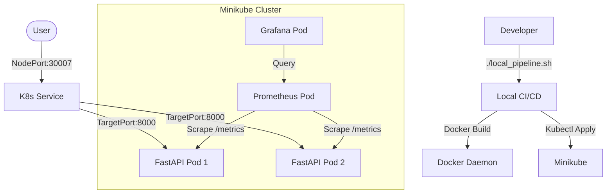

# DevOps Assignment (Local Edition)

This project demonstrates a production-grade DevOps implementation for a simple FastAPI service using **Local Kubernetes (Minikube)**, ensuring zero cloud costs while maintaining best practices.

## Architecture



## Features

1.  **Containerized Service**: FastAPI app (Multi-stage Dockerfile, Non-root).
2.  **Orchestration**: Kubernetes Deployment & Service (Replicas, Limits, Probes).
3.  **Local CI/CD**: `local_pipeline.sh` automates build, test, and deploy.
4.  **Monitoring**: Prometheus (Metrics) and Grafana (Visuals) running in-cluster.

## Prerequisites

- [Docker](https://docs.docker.com/get-docker/)
- [Minikube](https://minikube.sigs.k8s.io/docs/start/)
- [Kubectl](https://kubernetes.io/docs/tasks/tools/)

## Quick Start

### 1. Start Minikube

```bash
minikube start
```

### 2. Run Local Pipeline

This script builds the docker image and deploys to Kubernetes via kubectl.

```bash
# If on Linux/Mac
chmod +x local_pipeline.sh
./local_pipeline.sh

# If on Windows (Git Bash)
./local_pipeline.sh
```

**Note for Minikube Users**:
The script assumes standard docker behavior. If using Minikube's docker daemon is preferred to satisfy image pull policy:
```bash
eval $(minikube docker-env)
```

### 3. Access Services

-   **App**: `http://localhost:30007` (or `minikube service devops-app-service`)
-   **Grafana**: `http://localhost:30000` (User/Pass: admin/admin)
-   **Prometheus**: `http://localhost:30090`

## Monitoring Setup

-   **Prometheus** is configured to scrape the application pods.
-   **Grafana** is deployed. You will need to:
    1.  Login (admin/admin).
    2.  Add Data Source -> Prometheus -> URL: `http://prometheus-service:9090`.
    3.  Import Dashboard -> ID: `dashboard.json` (Create custom if needed).

## Security Best Practices implemented

-   **Non-Root User** in Dockerfile.
-   **Resource Limits** (CPU/Memory) in K8s Deployment.
-   **Liveness/Readiness Probes** for high availability.
-   **Least Privilege**: Service Accounts (default used here, but scoped in prod).
